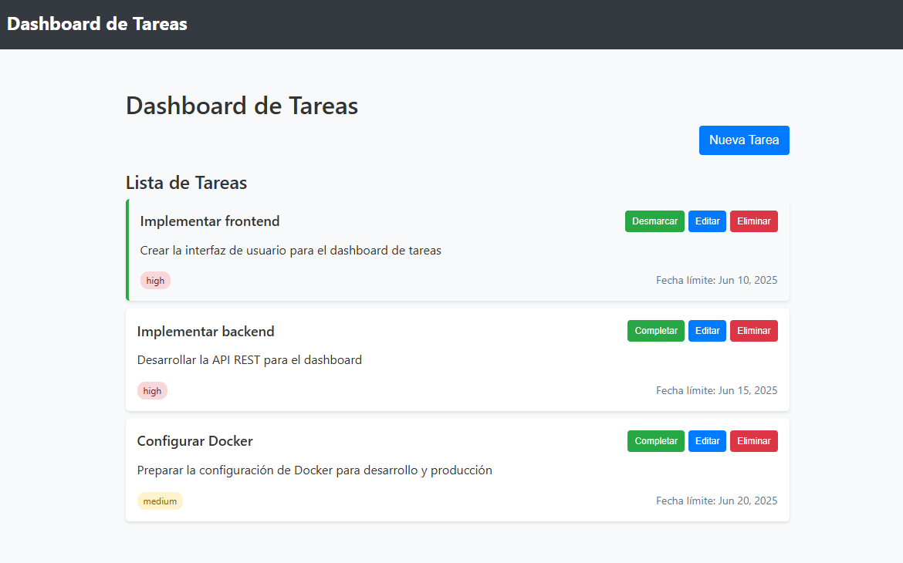

# Dashboard de Tareas



Un panel de gestión de tareas moderno construido con Angular, Node.js y Docker.

## 📋 Descripción del Proyecto

El Dashboard de Tareas es una aplicación web completa para gestionar tareas y actividades de forma eficiente. Permite crear, editar, eliminar y marcar tareas como completadas, todo ello con una interfaz responsive e intuitiva.

## ✨ Características

- ✅ CRUD completo de tareas (Crear, Leer, Actualizar, Eliminar)
- 📋 Gestión de prioridades para cada tarea
- 📅 Establecimiento de fechas límite
- 🔄 Actualización en tiempo real del estado de las tareas
- 📱 Diseño responsive para dispositivos móviles y escritorio
- 🔧 Fácil despliegue con Docker

## 🏗️ Arquitectura

El proyecto sigue una arquitectura de microservicios, dividida en:

- **Frontend:** Cliente Angular (v20+) con componentes standalone
- **Backend:** API REST desarrollada con Express.js
- **Infraestructura:** Contenedores Docker con nginx para el frontend

## 🛠️ Tecnologías Utilizadas

**Frontend**
- Angular 20
- TypeScript
- HTML5, CSS3
- RxJS para manejo de operaciones asíncronas
- Formularios reactivos para validación de datos
- Comunicación HTTP con el backend

**Backend**
- Node.js
- Express.js
- Middleware CORS para comunicación cross-origin
- RESTful API para la gestión de recursos

**Infraestructura**
- Docker y Docker Compose para contenerización
- Nginx como servidor web para el frontend
- Configuración de proxy para comunicación entre servicios

## 🚀 Instalación y Ejecución

### Con Docker (Recomendado)

1. Clona el repositorio:
git clone https://github.com/3orja/dashboard-tareas.git :
cd dashboard-tareas

3. Inicia los contenedores con Docker Compose:
docker-compose up --build

4. Accede a la aplicación en tu navegador:
http://localhost:4200/task

### Para Desarrollo

#### Frontend
cd frontend: npm install npm start
La aplicación estará disponible en `http://localhost:4200/task`

#### Backend
cd backend: npm install npm start

La API estará disponible en `http://localhost:3000/task`


## 🔌 API Endpoints

| Método | URL              | Descripción                    |
|--------|------------------|--------------------------------|
| GET    | `/api/tasks`     | Obtener todas las tareas       |
| GET    | `/api/tasks/:id` | Obtener una tarea específica   |
| POST   | `/api/tasks`     | Crear una nueva tarea          |
| PUT    | `/api/tasks/:id` | Actualizar una tarea existente |
| DELETE | `/api/tasks/:id` | Eliminar una tarea             |

## 📊 Modelo de Datos

```typescript
interface Task {
  id?: number;
  title: string;
  description?: string;
  completed: boolean;
  priority: 'low' | 'medium' | 'high';
  dueDate?: string;
  createdAt?: string;
}
